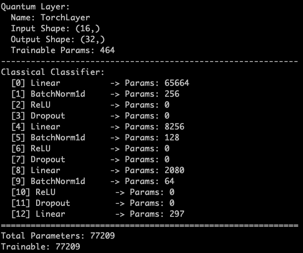
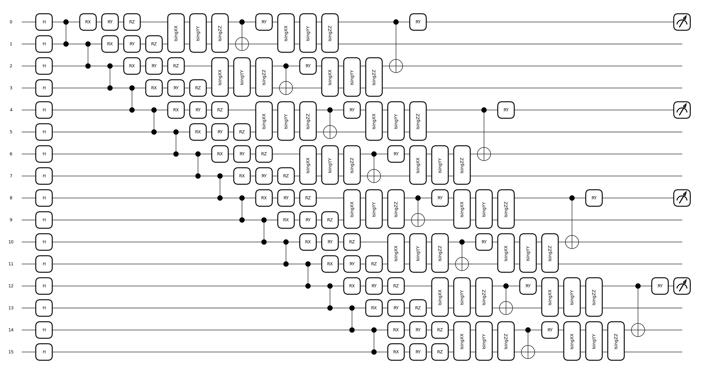
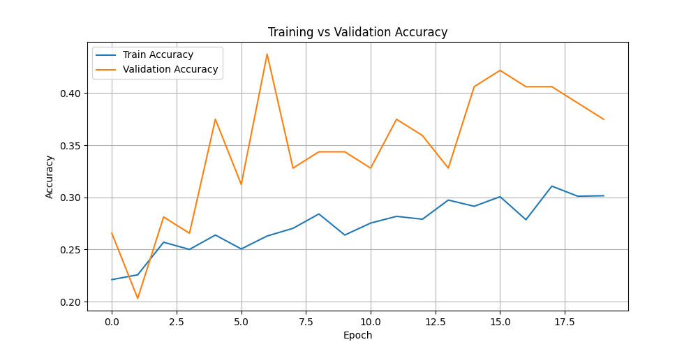
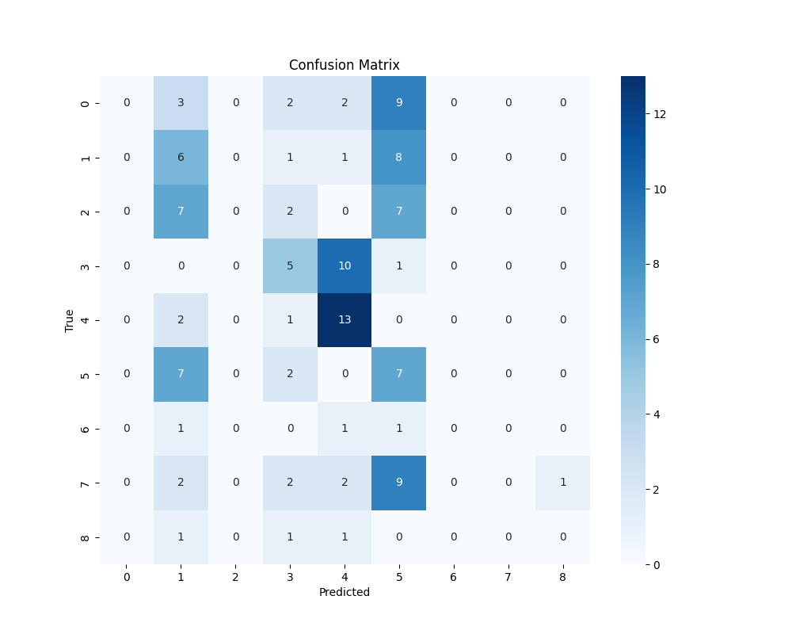
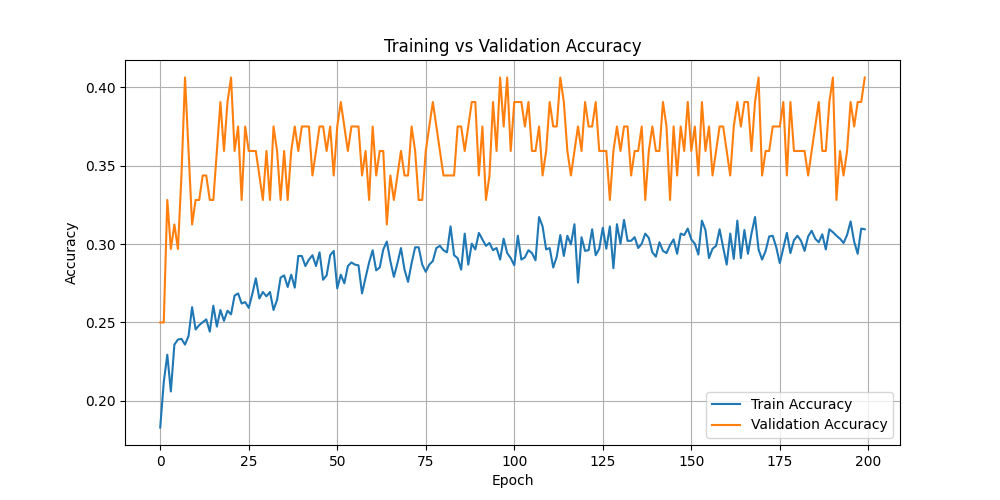
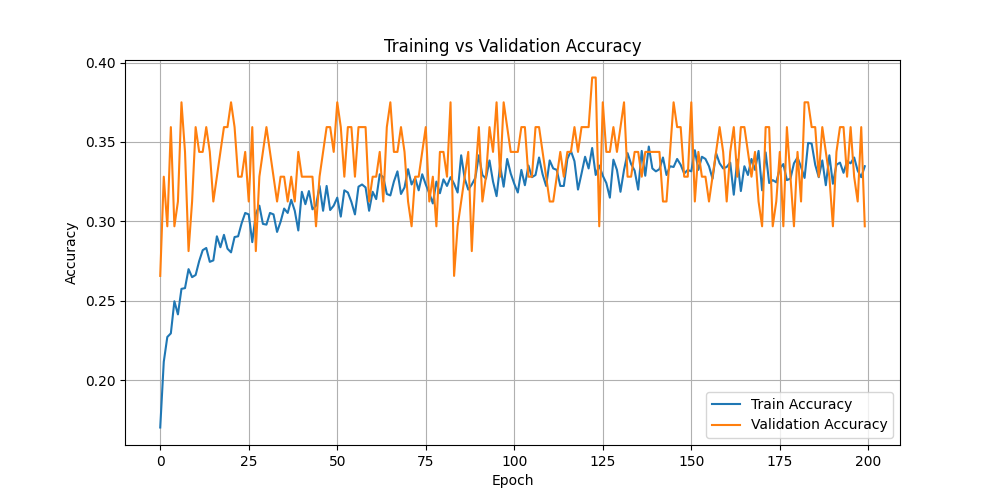

# Quantum Convolutional Neural Network (QCNN) with MERA and Pure QCNN for Image Classification

## Overview

This project implements both **hybrid** and **pure** quantum-classical neural networks based on the paper:

**"Quantum convolutional neural network for image classification"**
_Guoming Chen et al., Pattern Analysis and Applications, 2023_

The core idea is to use quantum circuits—specifically QCNNs built with MERA (Multi-scale Entanglement Renormalization Ansatz) and a newly added **pure QCNN**—to extract and process multi-scale features from classical image datasets. This implementation evaluates these models on a binary skin cancer classification task using the **ISIC 2018 dataset**.

---

## Project Highlights

- Implemented in **PennyLane** + **PyTorch**
- Two architectures supported:
  - **Hybrid QCNN** using `qml.templates.MERA` + Classical NN
  - **Pure QCNN** using layered entanglement and pooling
- Four quantum preprocessing pipelines supported:
  - **PCA** for dimensionality reduction
  - **HOG** (Histogram of Oriented Gradients) for edge-aware features
  - **PATCH-based encoding** to represent local image structures
  - **FRAC** and **FRAC with Entropy Map** using fractal-based descriptors
- Dataset: **ISIC 2018 (binary classification: benign vs malignant)**

---

## Dataset: ISIC 2018 Skin Cancer Classification

- Public dataset for skin lesion diagnosis
- This project elaborates the task to **multiclass classification**:
- Images are preprocessed using resizing, grayscale conversion, and contrast normalization.
- Label balancing and data augmentation (e.g., flipping) are optionally applied.

---

## Preprocessing Methods

### 1. PCA + MERA

- Input image is resized and flattened.
- PCA is applied to extract the top `k` components (typically 16 or 32).
- Each component is scaled to fit the input range of RX, RY, RZ rotations.
- These values are then encoded into a fixed-depth MERA circuit.

### 2. HOG + MERA

- Histogram of Oriented Gradients is computed from grayscale input.
- The descriptor is flattened and truncated to the number of qubits used (e.g., 16).
- This forms the quantum feature vector input to the MERA circuit.

### 3. PATCH-based MERA Encoding

- The input image (e.g., 256×256) is divided into fixed-size patches (e.g., 16 patches of 64×64).
- Each patch is flattened and normalized.
- Each patch is encoded separately into a **16-qubit MERA** circuit.
- The outputs from all patches are concatenated to form a complete quantum feature vector.

### 4. FRAC + Entropy Map (for Pure QCNN)

- Fractal-based entropy and slope values computed per image.
- Features are enriched using local entropy maps over grid patches.
- Output is a 32-dimensional vector encoded across **32 qubits**.

---

## Quantum Circuit Designs

### MERA Circuit (Hybrid Model)

- Based on `qml.templates.MERA`
- Hierarchically organized layers for multi-scale entanglement
- Uses `qml.qnn.TorchLayer` to embed it as the first layer of a PyTorch model
- Parameter counts are automatically determined based on:
  - `n_wires`: Number of qubits
  - `n_block_wires`: Size of the local block (set to 2 for entanglement)

### Pure QCNN Circuit

- No classical preprocessing layers; purely quantum convolution and pooling
- Composed of alternating:
  - **Convolution layers** with `IsingXX`, `IsingYY`, and `IsingZZ` gates
  - **Pooling layers** with `CNOT` + `RY` rotations
- Controlled reductions across qubit hierarchy: 32 → 16 → 8 → 4
- Final 4 qubits are measured and passed to a classical linear layer
- Also uses `qml.qnn.TorchLayer` for full gradient-based training

---

## Architectures

### Hybrid Quantum-Classical Model

1. Image → Classical Features (HOG, PCA, PATCH, FRAC)
2. Quantum Encoding using `qml.AngleEmbedding`
3. MERA Quantum Circuit → Quantum Feature Vector
4. Classical Fully Connected Network → Prediction

|  |
| :---------------------------------------------------------------: |
|                         Hybrid quantum NN                         |

### Pure QCNN Model

1. Image → Classical Feature Vector (FRAC, FRAC + Entropy)
2. Quantum Encoding + Pure QCNN:

   - Cluster state initialization (H + CZ)
   - Feature encoding (RX, RY, RZ)
   - Convolution (Ising gates)
   - Pooling (CNOT + RY)

3. Final 4 qubits → PauliZ → 4D vector → Linear Layer → Prediction

|  |
| :-------------------------------------------------------: |
|          Pure Quantum Circuit with Pool and Conv          |

## Evaluation

- Accuracy, Confusion Matrix, Training Curves
- Robustness (planned)
- Visualizations of quantum circuit and feature flow

##### Fractal Scale Feature Extraction (Hybrid)

|     |
| :-----------------------------------------------------------------------------: |
|  |
|                    Accuracy vs Validation + Confusion matrix                    |

##### HOG + MERA Feature Extraction (Hybrid with trainable MERA)

|  |
| :----------------------------------------------------------------------: |
|                Accuracy vs Validation + Confusion matrix                 |

##### PCA + MERA Feature Extraction (Hybrid with trainable MERA)

|  |
| :----------------------------------------------------------------------: |

| Accuracy vs Validation + Confusion matrix |

---

## How to Run

Install dependencies:

```bash
pip install -r requirements.txt
```

Train any model:

```bash
python quantum_NN/quantum_nn.py --features FRAC_ENTROPY --epochs 100
```

---

## Important CLI Arguments:

```bash
--features: One of [HOG, PCA, PATCH, FRAC, FRAC_ENTROPY]
--epochs: Number of training epochs (default: 100)
--batch: Batch size for training (default: 8)
--n_qubits: Set internally based on feature type
```
